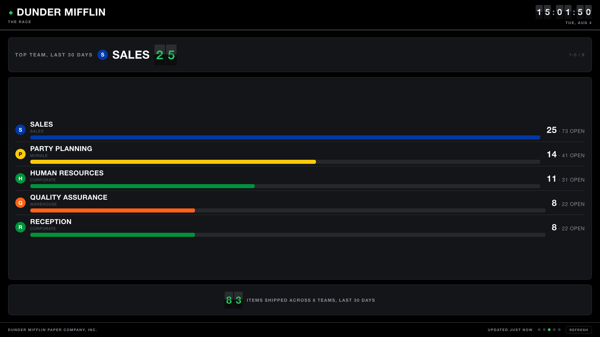
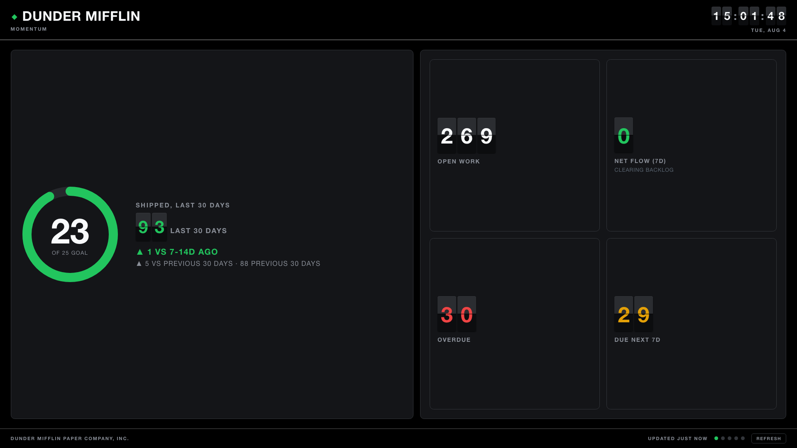
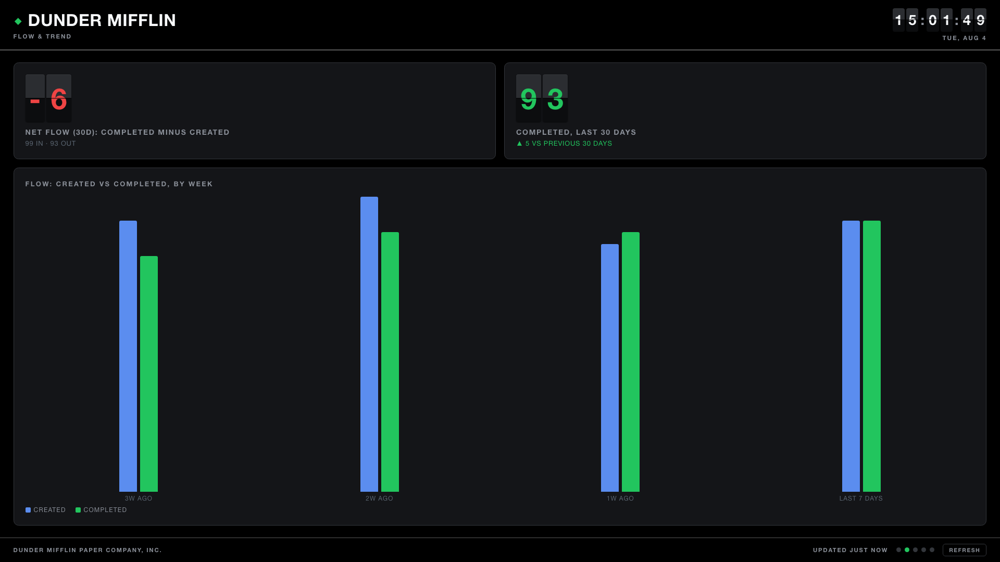
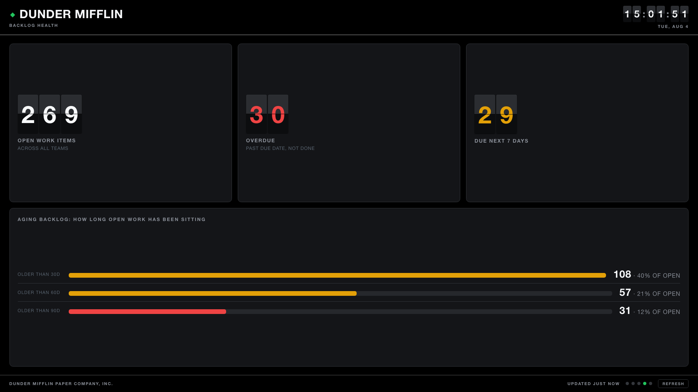
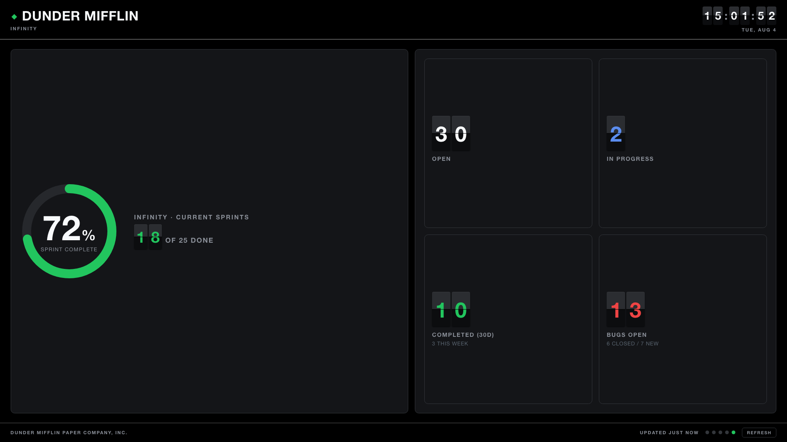

# Departures

A wallboard for Jira: your team's work as a split-flap departures board, on a TV, in about
five minutes.

[](https://github.com/felinefireman/departures-for-jira/actions/workflows/ci.yml)
[](LICENSE)



## What it is

One Cloudflare Worker, no runtime dependencies (wrangler is the only devDependency), storing in Workers KV. Every metric comes from Jira's `search/approximate-count`
endpoint, which returns a single number, so there's no per-person data to leak. I recommend using
<https://www.ablesign.tv> or similar browser-based signage to load the page on a TV, but it
will also work on a browser with widescreen-ish aspect ratio.

## Run it locally

```bash
npm install

npm run dev     # the shipped ACME config
# or
npm run demo    # the fuller demo board in the screenshots
```

Open <http://localhost:8787>. With no `.dev.vars`, the Worker has no Jira token, so it renders
on synthetic data.

To test locally against your real Jira data instead, create a `.dev.vars` file in the repo
root with `JIRA_HOST=`, `JIRA_EMAIL=`, and `JIRA_TOKEN=` on
their own lines.

## How it works

Cron writes to Workers KV, page loads read. A page load never queries Jira.

Every three hours the scheduled handler turns `config.js` into a set of JQL count queries,
fetches them, and stores one snapshot in KV. Open tabs re-read that snapshot every `pollMs`.

A constraint worked around here: Cloudflare's Free plan cap of 50 subrequests per invocation, and
each KPI is one Jira query. Rather than capping how many KPIs a config may have, a cursor in
KV walks the query list in chunks of 40 per run and merges each chunk over the last snapshot.
A config too big for one invocation just increases update latency instead of failing, and
`partial: true` identifies it while the first sweep is still filling in. The config builder shows
which side of that line a config is on.

A bad config fails at startup with every problem reported at once, not one error per attempt
and not a board that quietly shows zeroes.

## Deploy

You need a Cloudflare account, a Jira Cloud API token, and this repo cloned locally with
`npm install` already run.

1. In the Cloudflare dashboard, create a Worker named `departures` (this must match the `name`
   in `wrangler.jsonc` exactly): **Workers & Pages → Create → Create Worker**, deploy it with
   the default starter script. Step 6 replaces that script with the real code; this step just
   gives Cloudflare somewhere to attach the secrets below.
2. Create a Jira API token at <https://id.atlassian.com/manage-profile/security/api-tokens> and
   copy it. Use it right away to pull your real project keys, statuses and issue types from
   Jira:
   ```bash
   JIRA_HOST=your-org.atlassian.net JIRA_EMAIL=you@example.com JIRA_TOKEN=<paste your token> \
     npm run discover
   ```
   Then open [`tools/config-builder.html`](tools/config-builder.html) in a browser and type in what `discover` printed: team names,
   project keys, done statuses, which scenes to show. It totals the Jira queries your config
   will need against the 40-per-cron-run budget as you type. Click **Copy** (or **Download**)
   and save the result over [`config.js`](config.js).
3. Add two secrets on that Worker's page: **Settings → Variables and Secrets → Add**, both as
   type **Secret**:
   - `JIRA_TOKEN`: the same token from step 2.
   - `REFRESH_KEY`: any long random string, for example run `openssl rand -hex 20` in a
     terminal and paste the output. It gates `?refresh=1`.

   Click **Save and deploy**. Secrets added this way survive every future `npm run deploy`;
   pushing new code never wipes them.
4. Create the KV namespace twice, production and preview:
   ```bash
   npx wrangler kv namespace create KPIS
   npx wrangler kv namespace create KPIS --preview
   ```
   Paste both ids into `kv_namespaces[0]` in `wrangler.jsonc`. `wrangler deploy` fails while
   the `<your-kv-namespace-id>` placeholder is still there.
5. Open `wrangler.jsonc` in a text editor and replace the placeholders: `JIRA_HOST` is your
   Jira domain (for example `your-org.atlassian.net`), `JIRA_EMAIL` is the email address on
   your Jira account, the same one behind the token from step 2. Neither is a secret, so a plain text edit is fine.
6. `npm run deploy`. This replaces the placeholder script from step 1 with the real Worker;
   the secrets from step 3 stay in place. Cloudflare shows the Worker's URL on its dashboard
   page, something like `https://departures.<your-subdomain>.workers.dev`. Then prime the
   snapshot:
   ```bash
   curl -H "X-Refresh-Key: $REFRESH_KEY" \
     "https://departures.<your-subdomain>.workers.dev/api/kpis?refresh=1"
   ```
   The key also works as `?key=`, but the header keeps it out of your shell history. Before
   that call lands, `/api/kpis` returns `pending: true` and the board shows "warming up"
   rather than blocking a page load on Jira. After it, cron owns refreshing.
7. Confirm the token took: `curl .../health` should report `"demo": false`. If it reports
   `true`, the Worker found no `JIRA_TOKEN` and is quietly serving synthetic data.

[DEPLOY.md](DEPLOY.md) covers what's not above: cron tuning, the subrequest cap in depth, and
locking the board down with Cloudflare Access.

To publish a public demo board on synthetic data, point wrangler at the demo config instead.
It needs no secrets and runs no cron, but `wrangler deploy` still validates
the KV binding, so give it one real namespace id (demo mode never reads it):

```bash
npx wrangler kv namespace create DEPARTURES_DEMO   # paste the id into wrangler.demo.jsonc
npx wrangler deploy --config wrangler.demo.jsonc
```

## Configure it

Everything lives in [`config.js`](config.js): teams, project keys, colours, goals, which
scenes appear. It's the only file you edit.

Two ways to fill it in:

- Open [`tools/config-builder.html`](tools/config-builder.html) in a browser: fill in the
  form, watch the query budget, copy the result over `config.js`.
- Edit it by hand, after running `npm run discover` to list your project keys, statuses and
  issue types straight from Jira.

## The board

Five scenes, cross-fading every `rotateMs` (15 seconds by default), sized to one screen with
no scrolling.

| Scene | Shows |
|---|---|
| `momentum` | Goal ring for the week, 30-day total, week- and 30-day-over-30-day deltas |
| `flow` | Net flow over 30 days, weekly created-vs-completed bars |
| `race` | Team leaderboard by completions, auto-paging through every team |
| `backlogHealth` | Open, overdue, due-soon, and the aging funnel at 30/60/90 days |
| `spotlight` | One group of projects on its own card, with an optional sprint ring |

<table>
<tr>
<td></td>
<td></td>
</tr>
<tr>
<td></td>
<td></td>
</tr>
</table>

A **spotlight** lifts projects out of the leaderboard for work that doesn't compare
like-for-like with the rest: sprint-based delivery sitting next to ticket queues. Add as many
as you need. Without Jira Software boards, set `sprints: false` and the ring is dropped rather
than left empty.

Handy for a fixed display:

| URL | Effect |
|---|---|
| `/` | Rotates through every enabled scene |
| `/?scene=c` | Start on a specific scene (also accepts a spotlight's name, `/?scene=engineering`) |
| `/?rotate=0` | Hold one scene; `/?scene=e&rotate=0` for a permanent sprint board |
| `/?demo=1` | Synthetic data, for screenshots off a live deployment |

## Endpoints

| Path | Purpose |
|---|---|
| `/` | The board |
| `/api/kpis` | The stored snapshot as JSON |
| `/api/kpis?refresh=1` | Force a recompute, requires `REFRESH_KEY` |
| `/health` | Liveness, plus `demo: true` when the data is synthetic |

`/api/kpis` returns `{ generatedAt, values, errors }`, plus `stored: false` if the KV write
failed, `partial: true` while the first refresh sweep is still running, `pending: true` before
any snapshot exists, and `demo: true` for synthetic data. An open tab re-reads this endpoint
every `pollMs` (2 minutes by default), so a TV left running stays current.

## Access control

The Worker is public by default. It exposes counts only and holds no secrets in its output,
but a wallboard is still internal information: put a custom domain route on it in the
Cloudflare dashboard and restrict it with Cloudflare Access. Details in
[DEPLOY.md](DEPLOY.md).

## Token rotation

Atlassian API tokens expire one year after creation, and when one lapses every query fails and
the board goes blank. Rotate before then:

1. Create a token at <https://id.atlassian.com/manage-profile/security/api-tokens>
2. Paste it into `JIRA_TOKEN` under **Workers & Pages → departures → Settings → Variables and
   Secrets**
3. Update `JIRA_TOKEN` in `.dev.vars` for local work
4. Delete the old token once the board is using the new one

## License

Copyright the Departures contributors, licensed under the GNU Affero General Public License
v3.0, see [LICENSE](LICENSE).

## Contributing

[CONTRIBUTING.md](CONTRIBUTING.md) covers the one rule about the client script that's easy to
break by accident. `npm test` covers the parts that break quietly.
